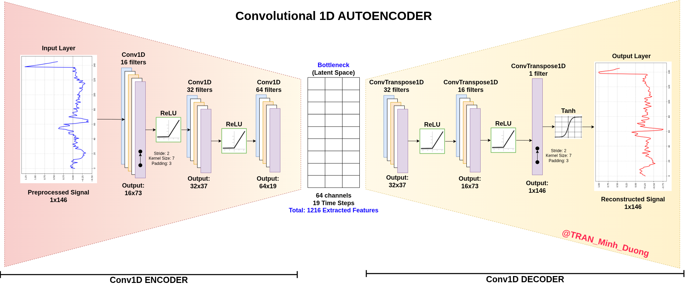
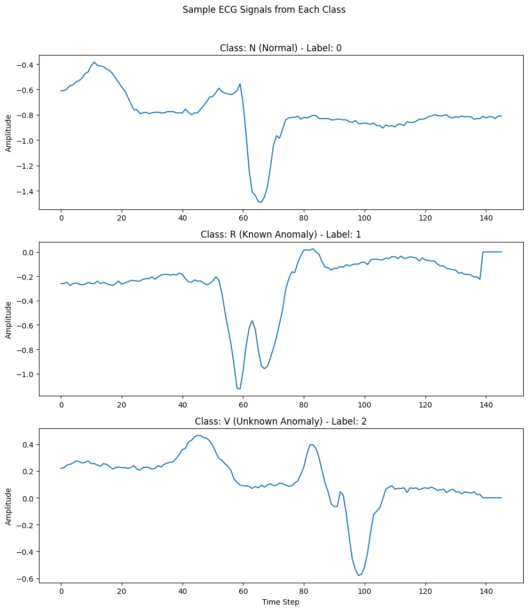
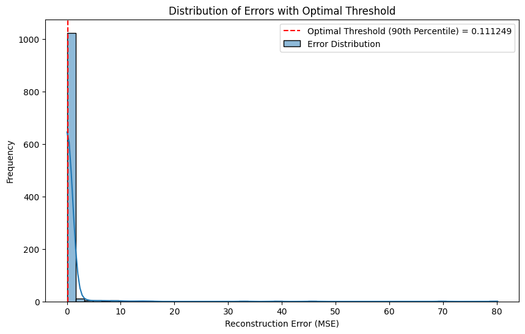
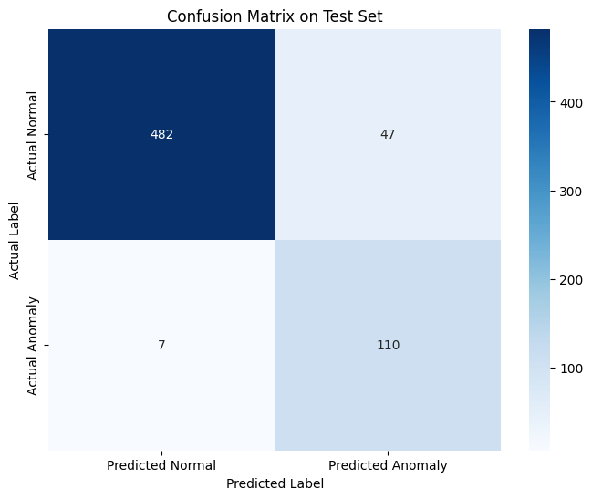
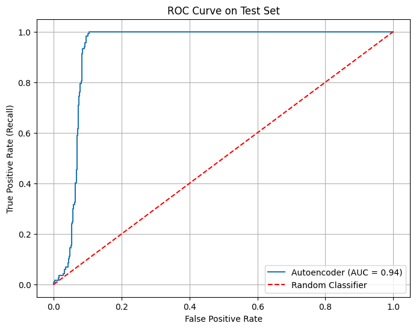
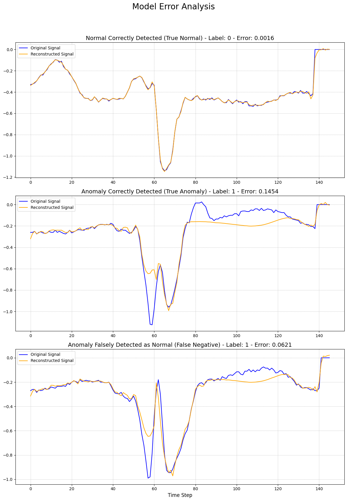
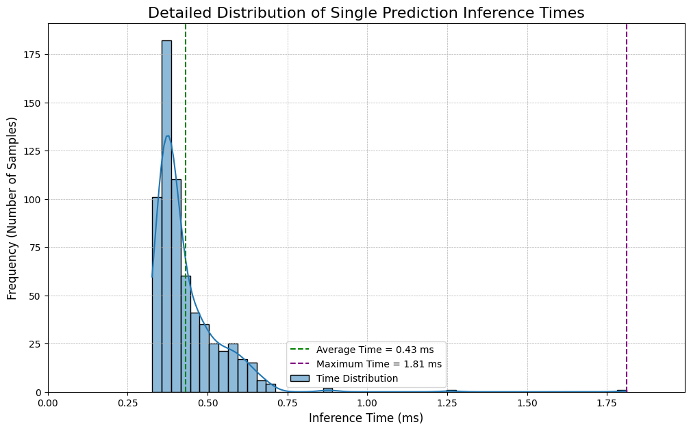
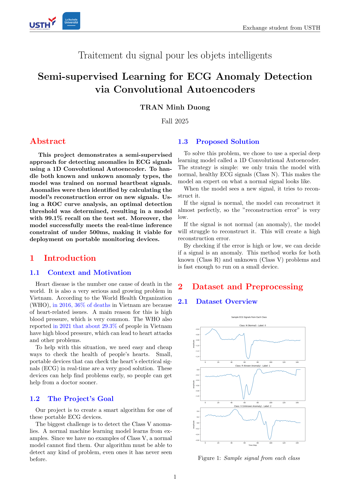

# ECG Anomaly Detection using a 1D Convolutional Autoencoder

This project is a semi-supervised approach to detecting cardiac anomalies in ECG signals, as required for a university project. The 1D Convolutional Autoencoder is trained **only on normal heartbeats** and uses the reconstruction error to identify both known and unknown anomalies (like the rare Class V).

---

## Key Results & Figures

The model's performance was evaluated by finding an optimal threshold on a validation set and applying it to an unseen test set.

### 1. Threshold Determination

The reconstruction errors for normal signals are heavily skewed, so a **90th percentile threshold** was chosen as a robust, data-driven method.

### 2. Final Model Performance

The final model is highly effective at its main goal: catching anomalies. It achieved **94% recall** (sensitivity) on the test set, missing only 1 out of 117 anomaly events.

| Final Confusion Matrix | Final ROC Curve |
| :---: | :---: |
|  |  |

### 3. Error Analysis

A visual analysis shows the model's behavior. It successfully reconstructs normal signals with low error, while anomalous signals produce a high error (note the y-axis). The one "False Negative" (bottom panel) was missed because its error was just below the threshold.

### 4. Real-Time Constraint

The model is highly efficient and meets the **< 500ms** real-time constraint for embedded devices. The average inference time on a CPU was **~1.21ms**.

### 5. Final report

If you're interested, read my [Final Report](./FINAL_REPORT_Anomaly_Detection_in_ECG_Signals.pdf) for more

